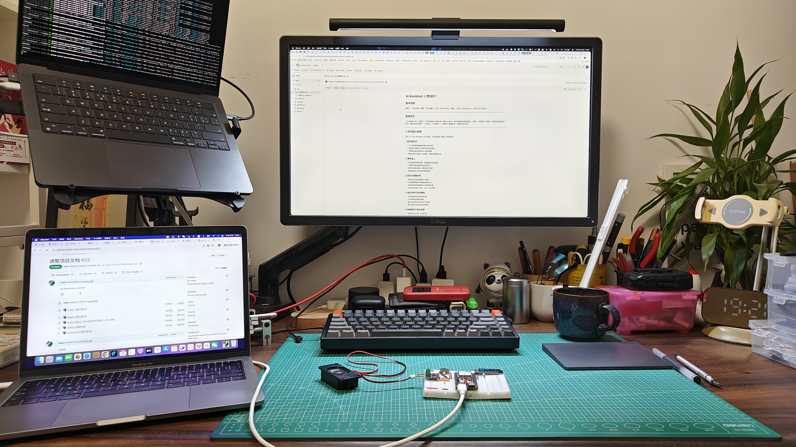

## 项目简介

子枫——是专为七牛云灵矽 AI 平台设计的一个 Z 世代的 AI 交互角色。

她彻底抛弃了传统 AI 的机械式回复，拥有鲜明的 Z 世代人格。子枫的人设核心是 “一半天使，一半恶魔”，人送外号“疯子”。她通过在对话中动态切换风格，既能提供专业的技术指导，也能用毒舌和挑战来激发开发者的潜力。

本项目的目标：利用七牛灵矽 AI 平台能力，构建一个富有情感、能够提升平台互动性与用户粘性的 AI 角色。

---

## 核心特性：人格双重奏

通过基于提示词工程（Prompt Engineering）实现的智能风格切换机制，子枫能在不同情境下智能切换人格风格。

| 模式/人格 | 功能定位 | 核心交互风格 |
| --- | --- | --- |
| 天使模式 (Angel Mode) | 伙伴与治愈者 | 温暖、积极、提供实操方案，鼓励探索与学习 |
| 恶魔模式 (Demon Mode) | 批判与挑战者 | 毒舌、解构、反叛、提出犀利哲学问题和质疑 |

## 快速体验

### 配置流程
- 注册七牛灵矽 AI 平台
- 新建智能体（智能体管理 > 新建智能体）
- 配置智能体角色
    - 设置角色介绍，将 prompt.md 中的内容填入（注意：将 {{assistant_name}} 替换为实际名称，如"子枫"或"彩菊"）
    - 设置大语言模型(LLM)
    - 设置角色音色（您可以在声音复刻中创建您的专属音色）
    - 保存配置
- 设备管理（如果有）
    - 添加您的智能体设备，如 ESP32 小智开发板

### 测试
#### 方法
- 您可以在配置智能体界面右边 “点击拔打” 在线测试
- 如果您配置了设备，你也可以启动设备进行对话测试

#### 测试场景
参考 test.md 中的测试场景进行验证。测试时注意:
- 验证天使/恶魔模式的切换时机是否恰当
- 检查语言风格是否符合 Z 世代特征
- 确认语音输出自然流畅

## 项目进展与计划

* [x] 调研了解 "什么是 Z 世代"
* [x] 分析梳理 Z 世代，核心特征、历史与文化背景、成长环境、价值观与矛盾性
* [x] 设计一个 AI 人物角色
* [x] 编写提示词 System Prompt
* [x] 设计测试问题 Test Question
* [x] ESP32 小智开发板测试

## 人员分工

- 王群：Z 世代相关内容调研、AI 人物角色设计
- 郑伟： 提示词设计，硬件调试
- 刘彩菊： 声纹复刻，测试

---

## Video
- [网页演示](http://p94onsyz7.bkt.clouddn.com/wecomback.mp4)
- [Esp 32 开发板演示](http://p94onsyz7.bkt.clouddn.com/wecomback-esp32-s.mp4)

## Photo

---

⭐ 欢迎为本项目点亮小星星，或通过七牛灵矽 AI 与子枫交流！

### 🥚 命名彩蛋：关于“子枫”和“彩菊”

* 人设原名：子枫
* 现场语音触发名：彩菊
    * *说明：* 由于七牛灵矽 AI 平台的语音识别（ASR）模型对于“子枫”的识别率不理想，我们在测试中使用了识别准确率更高的 “彩菊” 作为语音指令的触发词，但这并不影响子枫的 “疯” 与 “Z 世代”人格设定！

### 📧 贡献与联系

本项目为七牛云内部黑客松参赛作品，欢迎提出建议和反馈。

* 项目小组： [We come back]
* 七牛灵矽 AI 文档： [https://linx.qiniu.com/docs/](https://linx.qiniu.com/docs/)
